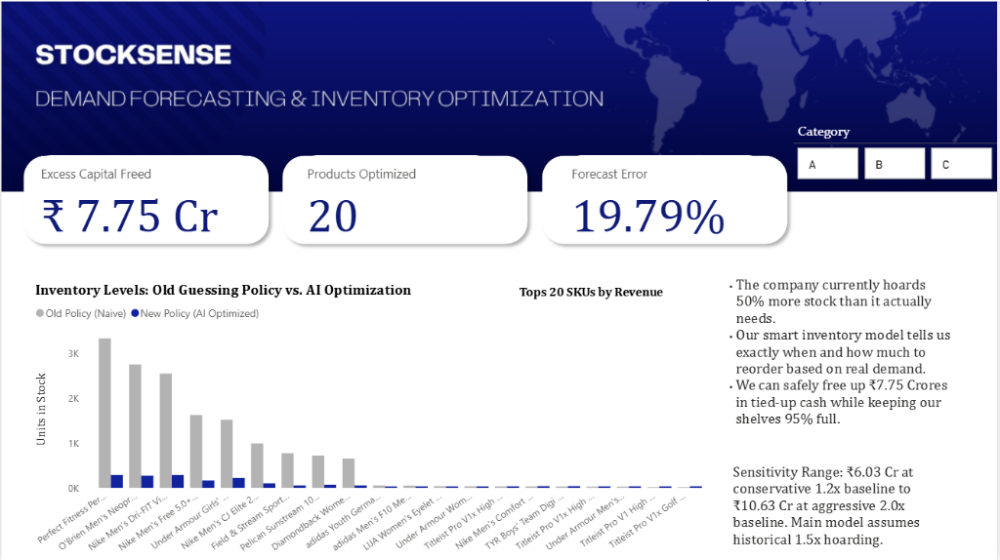

# StockSense — Demand Forecasting & Inventory Optimization

## Problem
In supply chain management, guessing inventory levels leads to massive financial waste. Businesses often hoard excess inventory (tying up millions in dead capital) just to avoid the risk of running out of stock and losing sales.

## Impact
- Identified **₹7.75 Cr** in excess inventory across the top 20 SKUs by eliminating unnecessary buffer hoarding.
- Backtest: Over a 6-month simulation, the AI Model had only **1 stockout day** compared to **8 stockout days** for the old hoarding policy, while holding drastically less stock.
- Forecast accuracy: **WAPE 19.79%** using a rolling 1-step Holt-Winters model.

## Approach
1. Cleaned and analyzed 3 years of order data (DataCo Smart Supply Chain, Kaggle). *(Note: Raw dataset is large and not included in this repo; it can be downloaded directly from Kaggle).*
2. ABC-classified products by revenue contribution to focus strictly on the top 20 highest-impact SKUs.
3. Forecasted demand per product using Holt-Winters exponential smoothing to capture trends and seasonality.
4. Calculated safety stock, reorder point (ROP), and Economic Order Quantity (EOQ) dynamically per product.
5. Backtested the optimized policy against a naive historical baseline over 180 days to prove financial viability.
6. Built a 3-page Power BI dashboard for executive decision-making and live warehouse action plans.

## Key Finding
Current practice holds ~50% more stock than demand patterns justify, yet still suffers from minor stockouts due to inefficient reordering logic. By using AI, we can drastically reduce capital tied up in the warehouse while maintaining a 95% service level.

## Assumptions
- **Lead time:** 2 days (Standard delivery variation).
- **Service level:** 95% (Accepting a 5% risk of stockout to avoid holding massive amounts of dead capital).
- **Naive baseline:** 1.5x monthly demand (sensitivity tested at 1.2x–2.0x).

## Tech Stack
Python (pandas, numpy, statsmodels), Power BI, DAX.

## Dashboard

## What I'd do with more time
- Incorporate live supplier delivery tracking to dynamically adjust Lead Time assumptions instead of using a static 2-day average.
- Integrate real-time inventory snapshots via API instead of simulating the "Current Stock" warehouse conditions.
- Test the forecasting model across a second dataset from a different industry to validate robustness against highly volatile seasonal spikes.
